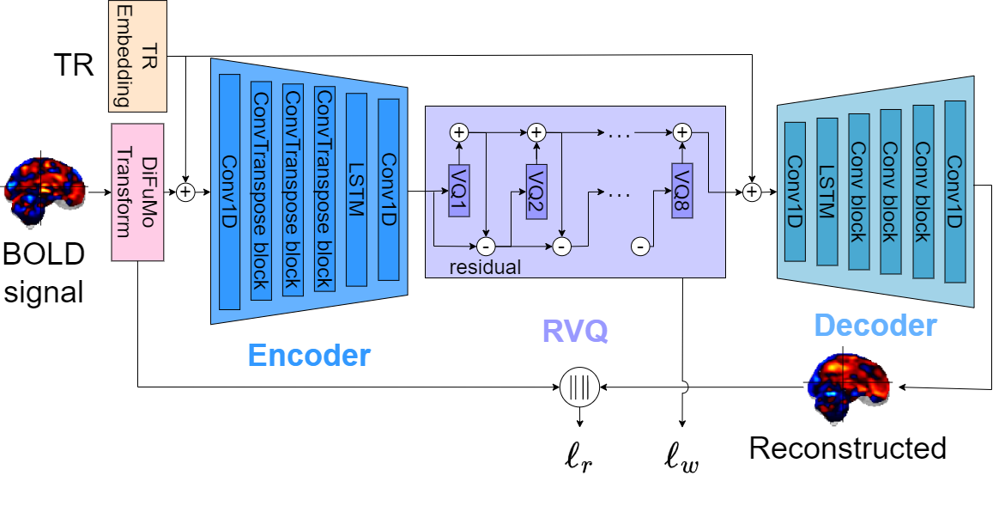

# BrainCraft



BrainCraft is a PyTorch library based on AudioCraft. BrainCraft currently includes the inference and training code for BrainCodec.

## Datasets
* **For upstream and downstream tasks**:
    * Download the data from [learning-from-brains](https://github.com/athms/learning-from-brains).
* **For resting-state fMRI**:
  *  Download from [here](https://drive.google.com/drive/folders/1RYetEquBbOsWz5P3Z5i0levYhIev3a92?usp=sharing).
  * Note: Due to licensing restrictions, the SRPBS Traveling Subject MRI Dataset mentioned in the paper cannot be redistributed. You need to download it yourself and create a tarfile.

## Models
At the moment, BrainCraft contains the training code and inference code for:

* [**BrainCodec**](docs/BRAINCODEC.md) (ours): A state-of-the-art neural codec model for fMRI data
* [**CSM**](docs/CSM.md) ([Thomas et al. (2022)](https://arxiv.org/abs/2206.11417)) : A baseline model for decoding of cognitive brain states
* [**CSM+BrainCodec**](docs/CSM_BRAINCODEC.md) (ours): A state-of-the-art decoding model of cognitive brain states

Additionally, the list of available pre-trained weights is as follows:


| Model | Downstream | Pre-trained Weight |
| --- |  --- | --- |
| BrainCodec                 | - | [Link](https://drive.google.com/drive/folders/1dMyoP8w552dl1eXwAOpPoxgDCTjft_5f?usp=sharing) |
| CSM                 | HCP | [Link](https://drive.google.com/drive/folders/1VWqZfMjU1wEbwFPF7Y_b7yjuDxcROFGG?usp=sharing) |
| CSM                 | MDTB | [Link](https://drive.google.com/drive/folders/1twbeYCr43YjDxaxWZ1Sx9WAzPw6XxvZv?usp=sharing) |
| CSM                 | Over100 | [Link](https://drive.google.com/drive/folders/1AC7_Ug7_BkwMhIS-vMBt__l6QbtABnrQ?usp=sharing) |
| CSM + BrainCodec                 | HCP | [Link](https://drive.google.com/drive/folders/1eirUVyRQdInTFwOyCM2yv9HLMOcqF_co?usp=sharing) |
| CSM + BrainCodec                 | MDTB | [Link](https://drive.google.com/drive/folders/1-FzhiCeUIX7paxiweYL-j1nGpe6jzHeR?usp=sharing) |
| CSM + BrainCodec                 | Over100 | [Link](https://drive.google.com/drive/folders/1IbvcqQMaM9PX2Fn-aSUsXXPnKPW49-UE?usp=sharing) |

## Installation
BrainCraft requires Python 3.9 and PyTorch 2.1.0. To install BrainCraft, you can run the following:

```shell
# Best to make sure you have torch installed first, in particular before installing xformers.
# Don't run this if you already have PyTorch installed.
pip install 'torch>=2.1'
pip install -e .
```

We also recommend having `ffmpeg` installed, either through your system or Anaconda:
```bash
sudo apt-get install ffmpeg
# Or if you are using Anaconda or Miniconda
conda install "ffmpeg<5" -c conda-forge
```

## License
- **Code**: Released under the [MIT License](./LICENSE).
- **Model Weights and Datasets**: Released under the [CC-BY-NC 4.0 License](./LICENSE_weights).

## Citation

For the general framework of BrainCraft, please cite the following.
```
Not yet published
```

## Acknowledgement
This repository is implemented based on [AudioCraft](https://github.com/facebookresearch/audiocraft).
